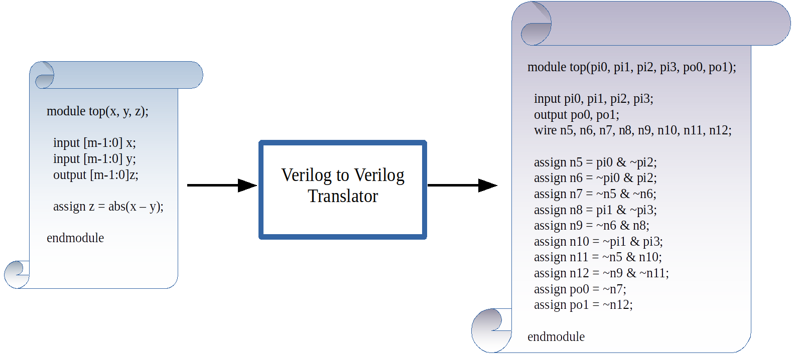
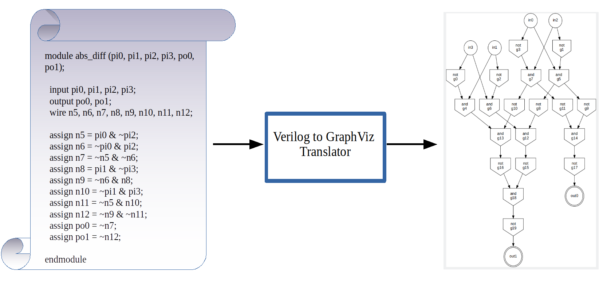
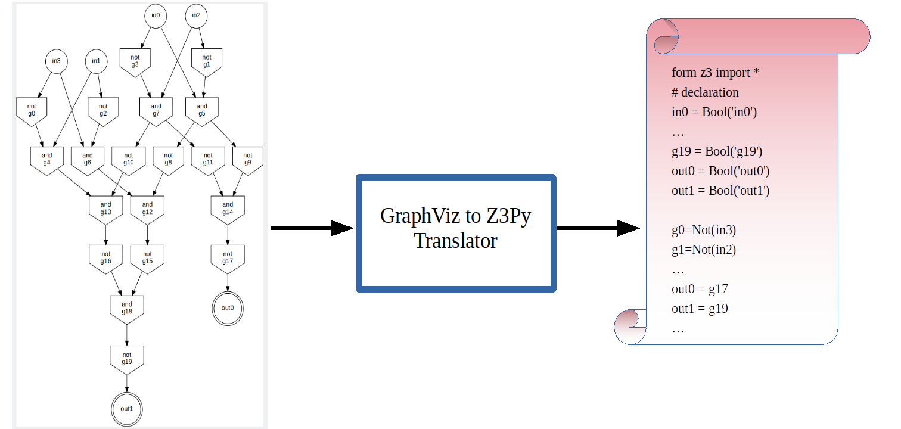
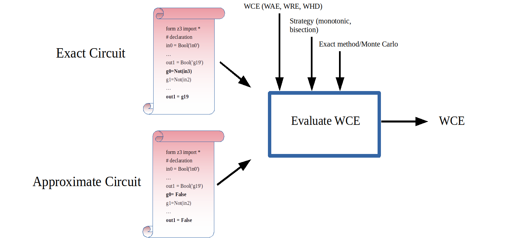

# translators

This project contains three translators for circuit representation in different formats, a testbench generator for circuits expressed in Verilog, and a verifier for testing.

1. **Verilog to Verilog translator**: 

   Takes in a Verilog in any format (structural, behavioral, etc) and it outputs a Gate-Level limited Verilog (_clean Verilog_) representation which is funcionally equivalent to the input
   
   
   
  ||
  |:--:|
  | *An example of Verilog to Verilog translator on an m-bit Absolute Difference circuit* |
  
  

2. **Verilog to GraphViz translator**:

Takes in a _clean Verilog_ converts it into a graph representation in GraphViz format

||
|:--:|
| *An example of Verilog to GraphViz translator on a 2-bit Absolute Difference circuit* |
   
   
   
3. **GraphViz to z3py translator**: 
   
   Takes in a circuit graph in GraphViz format and converts it into its z3py representation that is readable by Z3 SMT-solver
   
||
|:--:|
| *An example of GraphViz to Z3py translator on a 2-bit Absolute Difference circuit* |
   
   
4. **Testbench generator**: 
   
   Takes in a _clean Verilog_ and the number of samples and generates a testbench over the samples
     
   
   
5. **Verify z3py representation**: 

   Takes in a Verilog in any format, generates a z3py and testbench from it, and test whether the functionalities of the two are equivalent
   
   
   
6. **Evaluate Worst-Case-Error(WCE) of an input circuit**:

   Takes in an exact and approximate circuit in _clean Verilog_ form and reports its WCE
   
    ||
    |:--:|
    | *The flow diagram of evaluate_wce.py script* |   
   
7. **Labeling all gates of an input circuit**

   Takes in a circuit in _clean Verilog_ form and reports the WCE each gate when pruned. 

8. **Random pruning**

    Takes in a circuit in _clean Verilog_ format alongside _pruning percentage_ expressed as an integer *P*,
    and outputs an approximate circuit in z3py format by pruning *P* percent of the gates of the input circuit.
   
9. **Testing the experiments (1)labeling, (2)evaluating WCE, and (3)random pruning**

    Takes in a cricuit in _clean Verilog_ format, runs the desired experiment with three different strategies: 
    (1) monotonic, (2) bisection, and (3) monte carlo (mc) and verifies whether the results obtained are valid.
   

## Setting up:

clone the repository:

`$ git clone https://github.com/Laura-Pozzi-research-group/translators-morteza.git`

install `virtualenv` on your machine using the following command(s):

- Linux

`$ sudo apt-get install virtualenv`

- MacOS

later... 

- Windows

later...

- head to the **main/** directory and create a virtual environment:

`$ make setup`

- activate the environment:

`$ source venv/bin/activate`

- install requirements:

`$ make requirements`

- add the current directory to your `PYTHONPATH`:

`$ export PYTHONPATH="$PWD"`

## How to use:

### Benchmarks

1. Verilog:

    Circuits expressed in Verilog are the primary inputs to the framework and are located at **main/input/ver** directory

2. GraphViz:

    Circuits expressed in GraphViz (gv) format can serve as both input and output files, depending on the script that is launched.

3. Python:
    
    Similar to GraphViz files, circuits expressed in Z3py (py) format can serve as both input and output files, depending on the script that is launched.

### Launching scripts
From the **main/** directory and launch the desired script:

1) **Verilog to Verilog:**

`$ python3 script/v2v.py benchmark-name`

- _example: assuming that *abs_diff_i4_o3.v* is available at *input/ver* directory_

    `$ python script/v2v.py abs_diff_i4_o3.v`

2) **Verilog to GraphViz**

`$ python3 script/v2gv.py benchmark-name`

- _example: assuming that a clean Verilog of *abs_diff_i4_o3.v* is available at *output/ver* directory_

    `$ python script/v2v.py abs_diff_i4_o3.v`

3) **GraphViz to z3py**

`$ python3 script/gv2z3.py benchmark-name -s num-of-mc-samples`

- _example: assuming that *abs_diff_i4_o3.gv* is available at *output/gv* directory_

    `$ python script/gv2z3.py abs_diff_i4_o3.gv`

4) **Verilog to Testbench**

`$ python3 script/v2tb.py benchmark-name -s num-of-mc-samples`

- _example: assuming that *abs_diff_i4_o3.v* is available at *input/ver* directory, and the number of desired samples is 100_

    `$ python3 script/v2tb.py abs_diff_i4_o3.v -s 100`

5) **Verify z3py representation**

`$ python3 script/verify_z3.py benchmark-name -s num-of-mc-samples`

- _example: assuming that *abs_diff_i4_o3.v* is available at *input/ver* directory, and the number of desired samples is 100_

    `$ python3 script/verify_z3.py abs_diff_i4_o3.v -s 100`

6) **Evaluate WCE**

`$ python3 script/evaluate_wce.py exact-circuit-name -app approximate-circuit-name`

the csv report file is generated in the "output/report/" directory.

- _example: assuming that *abs_diff_i4_o3.v* (the exact circuit) and *abs_diff_i4_o3_app1.v* (the approximate circuit) are available at *input/ver* directory:
    
    `$ python3 script/evaluate_wce.py abs_diff_i4_o3.v -app abs_diff_i4_o3_app1.v`

7) **Label gates**

`python3 script/label_gates.py benchmark-name`

the csv report files are generated in the *output/report/benchmark-name/* directory.

- _example: assuming that *abs_diff_i4_o3.v* is available at *input/ver* directory:

    `python3 script/label_gates.py abs_diff_i4_o3.v`

8) **Random Pruning**

`python3 script/random_pruning.py benchmark-name -pp pruning_percentage`

the csv report files are generated in the *output/report/benchmark-name/* directory.

- _example: assuming that *abs_diff_i4_o3.v* is available at *input/ver* directory:

    `python3 script/random_pruning.py abs_diff_i4_o3.v -pp 10`

9) **Testing Experiments**

`python3 script/test_results_mc_bisection_monotonic.py benchmark-name`

- _example: assuming that *abs_diff_i4_o3.v* is available at *input/ver* directory:

    `python3 script/test_results_mc_bisection_monotonic.py abs_diff_i4_o3.v`

## NOTE:

All the results that are present in the report folder obtained using a machine with the following specs:

- Machine-name: ml-edge

- CPU: 3.30GHz Intel Core i9

- RAM: 256GBs

- OS: Linux Ubuntu 20.04LTS
